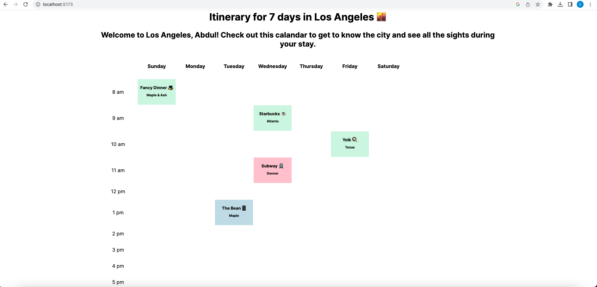

# timetabled

Timetable is a grid-style calendar with one-hour events that plans out a single week, built with React, Vite, HTML, JavaScript, and CSS. 


## Application Output



## Setup
Create a new React project using Vite
   - Download and install [Node.js](https://nodejs.org/en/download/)
   - Open the Terminal in VS Code using the menu (View -> Terminal) or the shortcut (ctrl + `)
       - Navigate to the folder on your computer using the cd
   - In your Github repository, initialize a new React project using Vite:
       - In the terminal, enter the command npm create vite@latest
       - Name the project timetabled
       - Select React as the framework (use the arrow keys and enter to navigate the menu)
       - Select JavaScript for the language variant
       
In the terminal, enter the command 
```sh
npm create vite@latest
```
Name the project timetabled
Select React as the framework (use the arrow keys and enter to navigate the menu)
Select JavaScript for the language variant

Run the timetabled React app:

Move into the timetabled directory: cd timetabled
Install the dependencies: 
```sh
npm install
```
Run the application in developer mode: 
```sh
npm run dev
```
Open project in the browser. Vite will display a link, such as http://127.0.0.1:5173 to click on or copy/paste that will take you to the localhost port where the project is running.
Pro Tip: if you'd like to stop the server, you can use ctrl + c or cmd + c within the Terminal, or us the trash can icon in the top right of the Terminal within VS Code. To run the server again, simply use npm run dev again.

### Dependencies

* [Vite](https://www.npmjs.com/package/vite)
* [Vite React Plugin](https://www.npmjs.com/package/@vitejs/plugin-react)
* [React](https://www.npmjs.com/package/react)
* [React-DOM](https://www.npmjs.com/package/react-dom)

---

